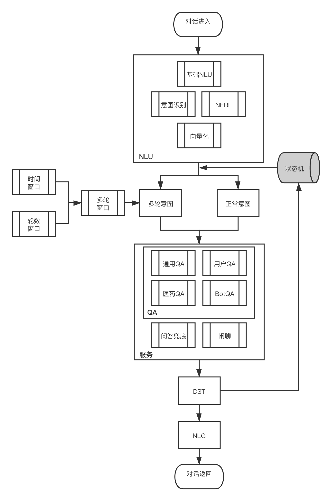

第七章-问答对话系统实现

主函数: ch7/main_handler.py

运行main_handler.py，执行其中的测试用例

骨架：

问答对话系统整体流程分为三个部分：

- NLU，自然语言理解，主要有两个功能
  - 对用户输入的问句进行语义理解，核心进行意图识别，指导后续对话管理模块选择服务执行。
  - 对各个服务均可能会使用到的nlu前序结果，进行统一调用、封装，供后续模块使用，减少重复调用。
- DM，对话管理
  - 基础功能：根据nlu结果，选择不同的服务模块进行调用，可能存在多个候选服务，形成候选服务列表，例如打招呼意图较为明确，只需要一个服务候选，而qa粗意图则需要四个服务候选。调用方式采用多线程并行方式，减少多模块调用时间开销，执行结束后同步返回结果，统一封装，并对多个模块的执行结果进行排序
  - qa能力：qa能力有三部分构成，分别是基于KG的qa模块（4个子模块，分别处理通用qa、医药qa、用户qa和bot人设qa，6.3已经介绍，直接作为现成模块调用）、基于IR的qa模块、基于MR的qa模块。qa意图的识别结果可以有两种，一种为粗意图，意图统一为qa，需qa子模块自行判断当前问句是否可回答，另一种为细意图，意图为特定子模块例如user_qa
  - 闲聊能力：由联想（6.4已经介绍，直接作为现成模块调用）和兜底两部分构成
  - 多轮能力：基于槽位继承的方式，对多轮qa进行支持，设计和维护多轮状态机，保存每轮的dst结果，设定多轮时间窗口（tll，过期时间）
- NLG，自然语言生成

# 整体流程

## NLU

调用NLU模块，获取对话意图，及通用自然语言理解

### 1.基础nlu

- 分词
- 词性标注

### 2.意图识别

- 打招呼
- QA
- 闲聊

### 3.NERL

### 4.向量化

## 对话管理

### 1.知识问答

- 基于知识图谱的问答模块，
  - 通用知识问答（百科KG）
  - 领域知识问答（医药KG）
  - 用户KG问答（用户KG）
  - BotKG问答（BotKG）

- 基于检索（IR）的问答，是QA服务的补充
  - 基于
  - 基于向量化检索
    - tf-idf
    - hnsw
- 基于机器阅读理解（MR）的问答，是QA服务的补充

- 闲聊
  - 打招呼
  - 联想
- 兜底回复
- 返回结果排序

## 多轮问答

## NLG

